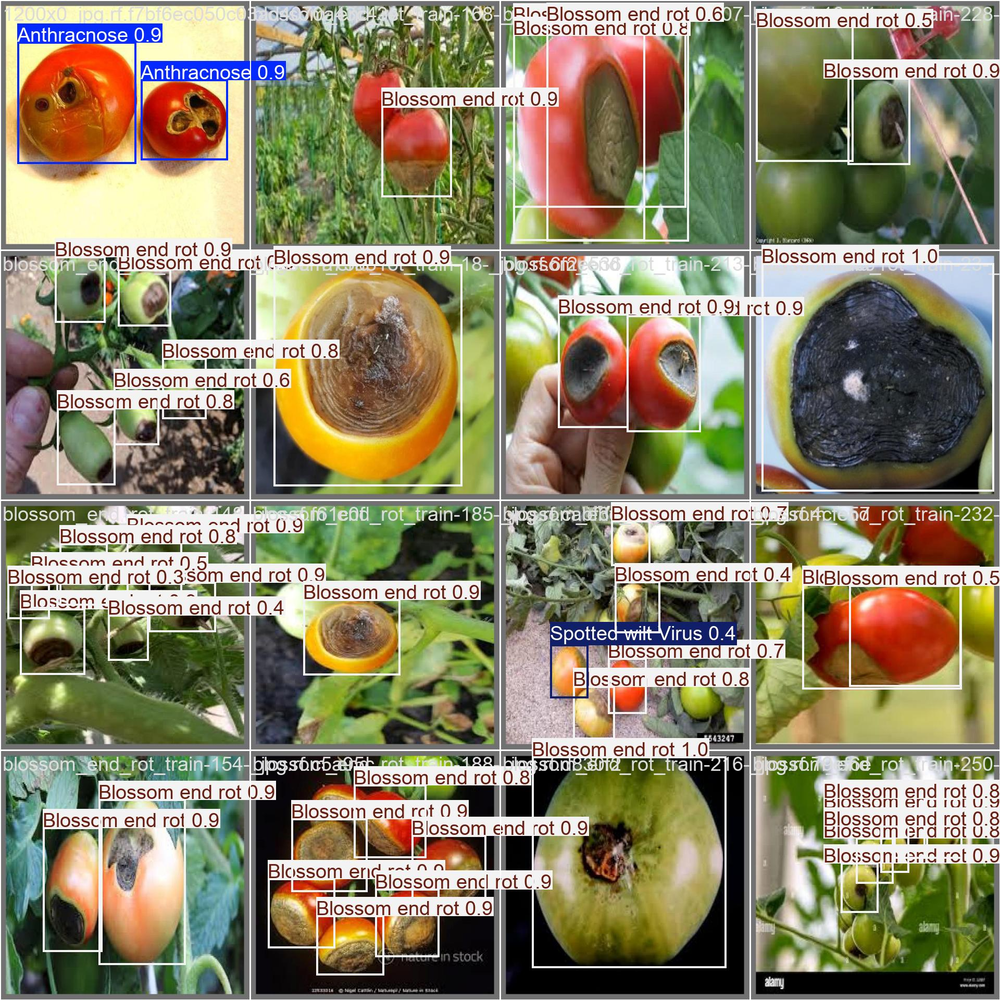
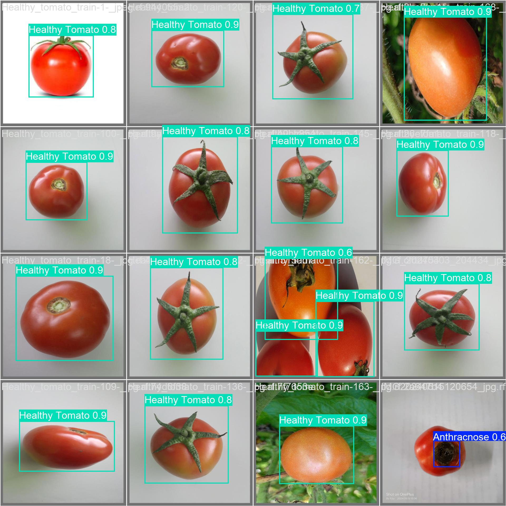

# Tomato Disease Detection with YOLOv5

## Description

This project aims to detect and classify various diseases in tomatoes using the YOLOv5 deep learning model. It is designed to assist farmers and agricultural technologists by providing a tool that can recognize common tomato ailments from images, helping in early diagnosis and treatment to improve crop health and yield.

## Features

- Disease detection in tomato plants using images.
- Classification among several types of diseases:
  - Anthracnose
  - Bacterial Spot
  - Blossom End Rot
  - Healthy Tomato
  - Spotted Wilt Virus
- High accuracy and real-time processing capabilities.

## Installation

To set up the project environment, follow these steps:

1. Clone the repository:

   ```bash
   git clone https://github.com/AbdulazizAnorboev/Tomato-Disease-Detection
   cd Tomato-Disease-Detection
   ```

2. Install the required dependencies:

   ```bash
   pip install -r requirements.txt
   ```

3. Download the dataset using the Roboflow API:
   Modify the dataset path in the provided code as necessary.

## Usage

### Training

To train the model with your dataset:

```bash
python train.py --data data.yaml --weights yolov5s.pt --epochs 500 --batch 64 --img 640
```

### Inference

To run inference and detect diseases in images:

```bash
python detect.py --weights runs/train/exp/best.pt --img 640 --conf 0.25 --source data/images/
```

### Validation

To validate the trained model:

```bash
python val.py --weights runs/train/exp/best.pt --data data.yaml --img 640
```

## Examples of Results

Below are some sample results from the model's inference on test images:

### Sample Detection Results

- **Infected Tomato**
  
- **Healthy Tomato**
  

## File Structure

The repository contains the following structure:

```
├── datasents/
│   ├── datasamples/
│   ├── data.yaml
│   ├── README.dataset.txt
│   └── README.roboflow.txt
├── models/
│   ├── hub/
│   ├── segment/
│   ├── __init__.py
│   ├── experimental.py
│   ├── tf.py
│   ├── yolo.py
│   ├── yolo51.yaml
│   ├── yolo5m.yaml
│   ├── yolo5n.yaml
│   ├── yolo5s.yaml
│   └── yolo5x.yaml
├── notebooks/
│   └── detection_tomato.ipynb
├── results
├── requirements.txt
└── README.md
└── LICENSE
```

## Contributing

Contributions are welcome! If you have suggestions or find bugs, feel free to fork the repository, make changes, and submit a pull request.

## License

This project is licensed under the MIT License - see the [LICENSE](LICENSE) file for details.

## Acknowledgements

- **Ultralytics**: For the YOLOv5 model.
- **Roboflow**: For the dataset API.
- **Community**: For support and feedback.
